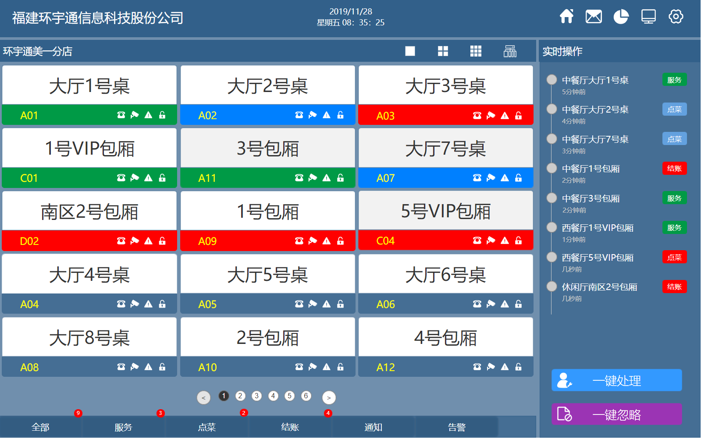

# 无线应用 app(W921)

## 简介

`根据后台传递来的数据消息在对应的卡片上显示，可以做相应的处理`

## 主页面



## 技术栈

### 路由

```javascript
1. 路由分为两部分: main和entry
- main: app的主界面,存在5个页面 home,message,statistics,map,settings
- entry: app可以跳转的所有页面
2. 所有页面支持根据主题变化颜色
3. 所有页面可以根据根的字体大小,同步调整所有页面字体大小
```

1. react-navigation(可扩展且使用简单的导航解决方案)

- https://www.npmjs.com/package/react-navigation

### 页面 UI

1. antd-mobile-rn(阿里 RN 页面)

- https://rn.mobile.ant.design/

### 仓库

```javascript
1. 所有对仓库的修改都是发送 ****_SUCCESS 事件
2. 如果要发送http请求就要发送 **** 事件,根据结果发送 ****_FAIL 或 ****_SUCCESS 事件
3. saga文件处理所有的异步请求
```

1. redux(管理数据状态)

- https://www.npmjs.com/package/redux

2. redux-saga(监听发送到 store 的请求,可以处理异步)

- https://www.npmjs.com/package/redux-saga

3. immutable(最大限度减少了复制和缓存数据的需求)

- https://www.npmjs.com/package/immutable

5. redux-persist(自动永久的保存 store 数据到本地)

- https://www.npmjs.com/package/redux-persist

6. react-native-storage(手动保存数据到本地)

- https://www.npmjs.com/package/react-native-storage

### 数据对接

```javascript
1. 封装axios,对每一个http请求做处理
2. 模拟数据定义在和api一个文件里面,方便查看数据类型和结构
```

1. axios(发送 http 请求)

- https://www.npmjs.com/package/axios

2. react_native_mqtt(订阅和发布 mqtt 消息)

- https://www.npmjs.com/package/react_native_mqtt

### 工具函数库

1. ramda(函数式编程库,不改变用户原有数据)

- https://www.npmjs.com/package/ramda

2. xe-utils(提供通用的函数)

- https://www.npmjs.com/package/xe-utils
